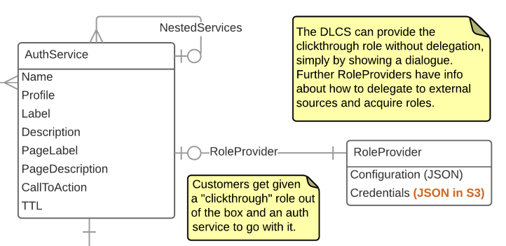

# AuthService

[IIIF Authentication](https://iiif.io/api/auth/1.0/) Service configuration. The services configured here are exposed by the DLCS on IIIF Image API endpoints, so that a viewer that supports the IIIF Auth specification can interact with them to acquire a cookie that will gain access to the images. The DLCS enforces access control on a customer's behalf (this is essential for performance when many hundreds of image tiles are requested). This means it is the DLCS that implements the IIIF auth flow on your behalf. In one special case, ['clickthrough'](https://iiif.io/api/auth/1.0/#clickthrough-interaction-pattern), you can configure an auth service in the DLCS that needs no runtime interation with your own systems. However, for more complex scenarios, the DLCS will need to direct the user to your (customer) servers during the auth flow, so that they can authenticate against your system. The DLCS then needs to query your system to acquire that user's roles, and thereby determine what level of service it can offer the user for a given protected image. See [RoleProvider](roleprovider.md) for information. The fields of AuthService give you control over how the service will be presented in a viewer that implements the IIF auth flow.

`/customers/{customer}/authServices/{authServiceId}`

## Supported operations

| Method | Label                             | Expects           | Returns           | Statuses                                        |
|--------|-----------------------------------|-------------------|-------------------|-------------------------------------------------|
| GET    | Retrieve an Auth Service          |                   | vocab:AuthService | 200 OK, 404 Not found                           |
| PUT    | Create or replace an Auth Service | vocab:AuthService | vocab:AuthService | 200 OK, 201 Created Auth Service, 404 Not found |
| DELETE | Delete the Auth Service           |                   | owl:Nothing       | 200 OK, 404 Not found                           |

<!--
PATCH not implemented
DELETE returns 200, not 205. Not owl:nothing but {"success": true} 
-->

## Supported properties

### name

Name of service

| domain            | range      | readonly | writeonly |
|-------------------|------------|----------|-----------|
| vocab:AuthService | xsd:string | False    | False     |

### profile

IIIF profile (what level of compliance). You will not usually set this.

| domain            | range      | readonly | writeonly |
|-------------------|------------|----------|-----------|
| vocab:AuthService | xsd:string | False    | False     |

### label

Label that appears in IIIF model. This should be used by the viewer to present the service to the user.

| domain            | range      | readonly | writeonly |
|-------------------|------------|----------|-----------|
| vocab:AuthService | xsd:string | False    | False     |

### description

Description that appears in IIIF model. This might be used by the viewer to present the service to the user.

| domain            | range      | readonly | writeonly |
|-------------------|------------|----------|-----------|
| vocab:AuthService | xsd:string | False    | False     |

### pageLabel

Label that appears on pages generated by DLCS. If the user needs to see an interstitial page provided by the DLCS, this is the heading of the page. An example might be 'you are about to be redirected to the single sign on system of institution X'

| domain            | range      | readonly | writeonly |
|-------------------|------------|----------|-----------|
| vocab:AuthService | xsd:string | False    | False     |

### pageDescription

Description that appears on pages generated by DLCS. As with the label above, used by the DLCS to generate pages to present to a user during the flow.

| domain            | range      | readonly | writeonly |
|-------------------|------------|----------|-----------|
| vocab:AuthService | xsd:string | False    | False     |

### callToAction

Label of button used on pages generated by DLCS (or clickthrough)

| domain            | range      | readonly | writeonly |
|-------------------|------------|----------|-----------|
| vocab:AuthService | xsd:string | False    | False     |

### timeToLive

How long a cookie session and bearer token are valid for (seconds)

| domain            | range                  | readonly | writeonly |
|-------------------|------------------------|----------|-----------|
| vocab:AuthService | xsd:nonNegativeInteger | False    | False     |

### childAuthService (🔗)

Child auth services of a parent (relationship between login and token,logout)

<!-- This was /nestedServices Tom to expand with how this is implemented in the DLCS. -->

| domain            | range            | readonly | writeonly |
|-------------------|------------------|----------|-----------|
| vocab:AuthService | hydra:Collection | True     | False     |

`/customers/{customer}/authServices/{childAuthServiceId}`

| Method | Label                             | Expects           | Returns           | Statuses                                          |
|--------|-----------------------------------|-------------------|-------------------|---------------------------------------------------|
| GET    | Retrieves all Nested Auth Service |                   | hydra:Collection  | 200 OK                                            |
| POST   | Creates a new Nested Auth Service | vocab:AuthService | vocab:AuthService | 201 Nested Auth Service created., 400 Bad Request |

### roleProvider (🔗)

External service that can be used by the DLCS to acquire roles for user sessions. See [RoleProvider](roleprovider.md).

| domain            | range              | readonly | writeonly |
|-------------------|--------------------|----------|-----------|
| vocab:AuthService | vocab:RoleProvider | True     | False     |

`/customers/{customer}/authServices/{authServiceId}/roleProvider`

| Method | Label                    | Expects | Returns    | Statuses              |
|--------|--------------------------|---------|------------|-----------------------|
| GET    | Retrieve a Role Provider |         | vocab:Role | 200 OK, 404 Not found |
