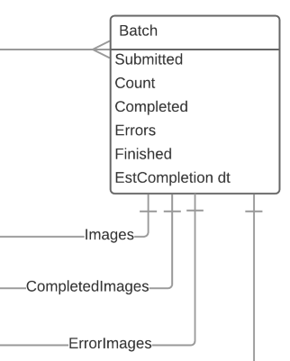

# Batch

Represents a submitted job of images. Typically you'd interact with this while it is being processed, or to update your internal systems with the status of images on the DLCS. The DLCS might clear out old batches after a specific time interval.

`/customers/{customer}/queue/batches`

## Supported operations

| Method | Label                | Expects | Returns     | Statuses              |
|--------|----------------------|---------|-------------|-----------------------|
| GET    | Retrieve all Batches |         | vocab:Batch | 200 OK, 404 Not found |

`/customers/{customer}/queue/batches/{batchId}`

## Supported operations

| Method | Label            | Expects | Returns     | Statuses              |
|--------|------------------|---------|-------------|-----------------------|
| GET    | Retrieve a Batch |         | vocab:Batch | 200 OK, 404 Not found |

## Supported properties

### submitted

Date the batch was POSTed to the queue

| domain      | range        | readonly | writeonly |
|-------------|--------------|----------|-----------|
| vocab:Batch | xsd:dateTime | True     | False     |

### count

Total number of images in the batch

| domain      | range                  | readonly | writeonly |
|-------------|------------------------|----------|-----------|
| vocab:Batch | xsd:nonNegativeInteger | True     | False     |

### completed

Total number of completed images in the batch

| domain      | range                  | readonly | writeonly |
|-------------|------------------------|----------|-----------|
| vocab:Batch | xsd:nonNegativeInteger | True     | False     |

### finished

Date the batch was finished, if it has finished (may still have errors)

| domain      | range        | readonly | writeonly |
|-------------|--------------|----------|-----------|
| vocab:Batch | xsd:dateTime | True     | False     |

### errors

Total number of error images in the batch

| domain      | range                  | readonly | writeonly |
|-------------|------------------------|----------|-----------|
| vocab:Batch | xsd:nonNegativeInteger | True     | False     |

### superseded

Has this batch been superseded by another? An image can only be associated with one active batch at a time. If no images are associated with this batch, then it has been superseded by one or more later batches. The DLCS does not update this property automatically, you can force an update by POSTing to the /test resource of a batch.

| domain      | range       | readonly | writeonly |
|-------------|-------------|----------|-----------|
| vocab:Batch | xsd:boolean | True     | False     |

### estCompletion

Estimated Completion (best guess as to when this batch might be finished)

| domain      | range        | readonly | writeonly |
|-------------|--------------|----------|-----------|
| vocab:Batch | xsd:dateTime | True     | False     |

### images (🔗)

Collection of all the images in the batch

| domain      | range            | readonly | writeonly |
|-------------|------------------|----------|-----------|
| vocab:Batch | hydra:Collection | True     | False     |

`/customers/{customer}/queue/batches/{batchId}/images`

| Method | Label                                             | Expects | Returns          | Statuses |
|--------|---------------------------------------------------|---------|------------------|----------|
| GET    | Retrieves all images in batch regardless of state |         | hydra:Collection | 200 OK   |

### test (🔗)

POST to this to force an update of the batch's superseded property. Returns JSON object with single success property (boolean). 

| domain      | range            | readonly | writeonly |
|-------------|------------------|----------|-----------|
| vocab:Batch | hydra:Collection | True     | False     |

`/customers/{customer}/queue/batches/{batchId}/test`

