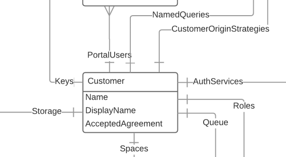

# Customer

A customer represents you, the API user. You only have access to one customer, so it is your effective entry point for the API. The only interation you can have with your Customer resource directly is updating the display name, but it provides links (🔗) to collections of all the other resources.

`/customers/{customer}`

## Example

[https://dlcs.azurewebsites.net/customers/4](https://dlcs.azurewebsites.net/customers/4)

## Supported operations

| Method | Label               | Expects | Returns        | Statuses              |
|--------|---------------------|---------|----------------|-----------------------|
| GET    | Retrieve a Customer |         | vocab:Customer | 200 OK, 404 Not found |

## Supported properties

### name

The URL-friendly name of the customer, can be used in URLs rather than customerId

| domain         | range      | readonly | writeonly |
|----------------|------------|----------|-----------|
| vocab:Customer | xsd:string | False    | False     |

### displayName

The display name of the customer

| domain         | range      | readonly | writeonly |
|----------------|------------|----------|-----------|
| vocab:Customer | xsd:string | False    | False     |

### portalUsers (🔗)

Collection of user accounts that can log into the portal. Use this to grant access to others in your organisation

| domain         | range            | readonly | writeonly |
|----------------|------------------|----------|-----------|
| vocab:Customer | hydra:Collection | True     | False     |

`/customers/{customer}/portalUsers`

| Method | Label                     | Expects          | Returns          | Statuses                                  |
|--------|---------------------------|------------------|------------------|-------------------------------------------|
| GET    | Retrieves all Portal User |                  | hydra:Collection | 200 OK                                    |
| POST   | Creates a new Portal User | vocab:PortalUser | vocab:PortalUser | 201 Portal User created., 400 Bad Request |

### namedQueries (🔗)

Collection of all the Named Queries you have configured (plus those provided 'out of the box'). See the [NamedQuery](namedquery.md) topic for further information

| domain         | range            | readonly | writeonly |
|----------------|------------------|----------|-----------|
| vocab:Customer | hydra:Collection | True     | False     |

`/customers/{customer}/namedQueries`

| Method | Label                     | Expects          | Returns          | Statuses                                  |
|--------|---------------------------|------------------|------------------|-------------------------------------------|
| GET    | Retrieves all Named Query |                  | hydra:Collection | 200 OK                                    |
| POST   | Creates a new Named Query | vocab:NamedQuery | vocab:NamedQuery | 201 Named Query created., 400 Bad Request |

### originStrategies (🔗)

Collection of configuration settings for retrieving your registered images from their origin URLs. If your images come from multiple locations you will have multiple origin strategies. See the [OriginStrategy](originstrategy.md) topic for futher information

| domain         | range            | readonly | writeonly |
|----------------|------------------|----------|-----------|
| vocab:Customer | hydra:Collection | True     | False     |

`/customers/{customer}/originStrategies`

| Method | Label                         | Expects              | Returns              | Statuses                                      |
|--------|-------------------------------|----------------------|----------------------|-----------------------------------------------|
| GET    | Retrieves all Origin Strategy |                      | hydra:Collection     | 200 OK                                        |
| POST   | Creates a new Origin Strategy | vocab:OriginStrategy | vocab:OriginStrategy | 201 Origin Strategy created., 400 Bad Request |

### authServices (🔗)

Collection of IIIF Authentication services available for use with your images. The images are associated with the auth services via Roles. An [AuthService](authservice.md) is a means of acquiring a role.

| domain         | range            | readonly | writeonly |
|----------------|------------------|----------|-----------|
| vocab:Customer | hydra:Collection | True     | False     |

`/customers/{customer}/authServices`

| Method | Label                      | Expects           | Returns           | Statuses                                   |
|--------|----------------------------|-------------------|-------------------|--------------------------------------------|
| GET    | Retrieves all Auth Service |                   | hydra:Collection  | 200 OK                                     |
| POST   | Creates a new Auth Service | vocab:AuthService | vocab:AuthService | 201 Auth Service created., 400 Bad Request |

### roleProviders (🔗)

Collection of the available role providers. In order for a user to see an image, the user must have at least one role associated with the image. [RoleProviders](roleprovider.md) represent how DLCS acquires roles.

| domain         | range            | readonly | writeonly |
|----------------|------------------|----------|-----------|
| vocab:Customer | hydra:Collection | True     | False     |

`/customers/{customer}/roleProviders`

| Method | Label                       | Expects | Returns          | Statuses |
|--------|-----------------------------|---------|------------------|----------|
| GET    | Retrieves all RoleProviders |         | hydra:Collection | 200 OK   |

### roles (🔗)

Collection of the available roles you can assign to your images. In order for a user to see an image, the user must have the role associated with the image, or one of them. Users interact with an [AuthService](authservice.md) to acquire a role or roles.

| domain         | range            | readonly | writeonly |
|----------------|------------------|----------|-----------|
| vocab:Customer | hydra:Collection | True     | False     |

`/customers/{customer}/roles`

| Method | Label               | Expects    | Returns          | Statuses                          |
|--------|---------------------|------------|------------------|-----------------------------------|
| GET    | Retrieves all Roles |            | hydra:Collection | 200 OK                            |
| POST   | Creates a new Role  | vocab:Role | vocab:Role       | 201 Role created, 400 Bad Request |

### queue (🔗)

The Customer's view on the DLCS ingest queue. As well as allowing you to query the status of batches you have registered, you can POST new batches to the queue.

| domain         | range       | readonly | writeonly |
|----------------|-------------|----------|-----------|
| vocab:Customer | vocab:Queue | True     | False     |

`/customers/{customer}/queue`

| Method | Label                                         | Expects          | Returns     | Statuses                                               |
|--------|-----------------------------------------------|------------------|-------------|--------------------------------------------------------|
| GET    | Returns the queue resource                    |                  | vocab:Queue | 200 OK                                                 |
| POST   | Submit an array of Image and get a batch back | hydra:Collection | vocab:Batch | 201 Job has been accepted - Batch created and returned |

### spaces (🔗)

Collection of all the Space resources associated with your customer. A space allows you to partition images, have different default roles and tags, etc. See the [Space](space.md) topic for more information.

| domain         | range            | readonly | writeonly |
|----------------|------------------|----------|-----------|
| vocab:Customer | hydra:Collection | True     | False     |

`/customers/{customer}/spaces`

| Method | Label                      | Expects | Returns     | Statuses |
|--------|----------------------------|---------|-------------|----------|
| GET    | Returns the space resource |         | vocab:Space | 200 OK   |

### keys (🔗)

Api keys allocated to this customer. The accompanying secret is only available at creation time. To obtain a key and a secret, make an empty POST to this collection with administrator privileges and the returned [Key](key.md) object will include the generated secret.

| domain         | range            | readonly | writeonly |
|----------------|------------------|----------|-----------|
| vocab:Customer | hydra:Collection | True     | False     |

`/customers/{customer}/keys`

| Method | Label                        | Expects | Returns   | Statuses |
|--------|------------------------------|---------|-----------|----------|
| GET    | Returns the api key resource |         | vocab:Key | 200 OK   |

### storage (🔗)

Storage policy for the Customer. See the [StoragePolicy](storagepolicy.md) topic for more information

| domain         | range                 | readonly | writeonly |
|----------------|-----------------------|----------|-----------|
| vocab:Customer | vocab:CustomerStorage | True     | False     |

`/customers/{customer}/storage`

| Method | Label                                 | Expects | Returns               | Statuses |
|--------|---------------------------------------|---------|-----------------------|----------|
| GET    | Returns the customer storage resource |         | vocab:CustomerStorage | 200 OK   |

### acceptedAgreement 

Has the customer accepted the EULA?

| domain         | range       | readonly | writeonly |
|----------------|-------------|----------|-----------|
| vocab:Customer | xsd:boolean | True     | False     |

