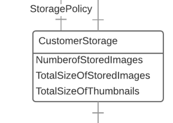

# CustomerStorage



Information resource that shows the current storage use for a Customer or for an individual Space within a customer.


```
/customers/{customer}/storage
/customers/{customer}/spaces/{space}/storage
```


## Supported operations


| Method | Label                    | Expects | Returns               | Statuses              |
|--------|--------------------------|---------|-----------------------|-----------------------|
| GET    | Retrieve CustomerStorage |         | vocab:CustomerStorage | 200 OK, 404 Not found |


## Supported properties


### numberOfStoredImages

Number of stored images


| domain                | range       | readonly | writeonly |
|-----------------------|-------------|----------|-----------|
| vocab:CustomerStorage | xsd:integer | True     | False     |


### totalSizeOfStoredImages

Total storage usage for images excluding thumbnails, in bytes


| domain                | range       | readonly | writeonly |
|-----------------------|-------------|----------|-----------|
| vocab:CustomerStorage | xsd:integer | True     | False     |


### totalSizeOfThumbnails

Total storage usage for thumbnails, in bytes


| domain                | range       | readonly | writeonly |
|-----------------------|-------------|----------|-----------|
| vocab:CustomerStorage | xsd:integer | True     | False     |


### lastCalculated

When the DLCS last evaluated storage use to generate this resource


| domain                | range        | readonly | writeonly |
|-----------------------|--------------|----------|-----------|
| vocab:CustomerStorage | xsd:dateTime | True     | False     |


### storagePolicy (🔗)

When the customer storage resource is for a Customer rather than a space, it will include this property which configures the total storage permitted across all Customer's spaces. See [StoragePolicy](storagepolicy.md) for more information.


| domain                | range               | readonly | writeonly |
|-----------------------|---------------------|----------|-----------|
| vocab:CustomerStorage | vocab:StoragePolicy | True     | False     |


`/customers/{customer}/storagePolicy/{storagePolicy}`

