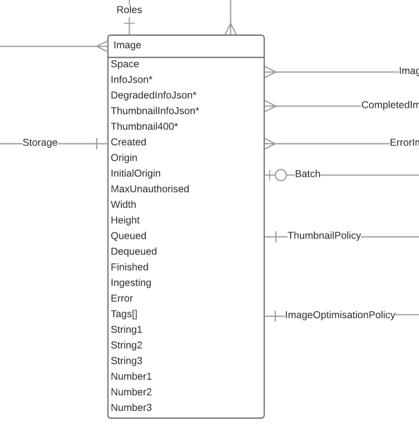

# Image

The "Image" resource is the DLCS view of an asset that you have registered (Image, Audio or Video file). The job of the DLCS is to offer services on that image, such as IIIF Image API endpoints. As well as the status of the image, the DLCS lets you store arbitrary metadata that you can use to build interesting applications.

## Example

[https://dlcs.azurewebsites.net/customers/4/spaces/11/images/578c021b00000](https://dlcs.azurewebsites.net/customers/4/spaces/11/images/578c021b00000)

`/customers/{customer}/spaces/{spaceId}/images/{imageId}`

## Supported operations

| Method | Label                                   | Expects     | Returns     | Statuses                                                       |
|--------|-----------------------------------------|-------------|-------------|----------------------------------------------------------------|
| GET    | Retrieve a Image                        |             | vocab:Image | 200 OK, 404 Not found                                          |
| PUT    | create or replace a Image               | vocab:Image | vocab:Image | 200 OK, 201 Created Image, 404 Not found                       |
| PATCH  | Update the supplied fields of the Image | vocab:Image | vocab:Image | 205 Accepted Image, reset view, 400 Bad request, 404 Not found |
| DELETE | Delete the Image                        |             | owl:Nothing | 205 Accepted Image, reset view, 404 Not found                  |

## Supported properties

### created

Date the image was added

| domain      | range        | readonly | writeonly |
|-------------|--------------|----------|-----------|
| vocab:Image | xsd:dateTime | True     | False     |

### origin

Origin endpoint from where the original image can be acquired (or was acquired)

| domain      | range      | readonly | writeonly |
|-------------|------------|----------|-----------|
| vocab:Image | xsd:string | False    | False     |

### initialOrigin

Endpoint to use the first time the image is retrieved. This allows an initial ingest from a short term s3 bucket (for example) but subsequent references from an https URI.

| domain      | range      | readonly | writeonly |
|-------------|------------|----------|-----------|
| vocab:Image | xsd:string | False    | True      |

### maxUnauthorised

Maximum size of request allowed before roles are enforced - relates to the effective WHOLE image size, not the individual tile size. 0 = No open option, -1 (default) = no authorisation. Used in conjunctino with "roles" property.

| domain      | range       | readonly | writeonly |
|-------------|-------------|----------|-----------|
| vocab:Image | xsd:integer | False    | False     |

### width

Tile source width

| domain      | range       | readonly | writeonly |
|-------------|-------------|----------|-----------|
| vocab:Image | xsd:integer | True     | False     |

### height

Tile source height

| domain      | range       | readonly | writeonly |
|-------------|-------------|----------|-----------|
| vocab:Image | xsd:integer | True     | False     |

### finished

When the image processing finished (image ready)

| domain      | range        | readonly | writeonly |
|-------------|--------------|----------|-----------|
| vocab:Image | xsd:dateTime | True     | False     |

### ingesting

Is the image currently being ingested?

| domain      | range       | readonly | writeonly |
|-------------|-------------|----------|-----------|
| vocab:Image | xsd:boolean | True     | False     |

### error

Reported errors with this image

| domain      | range      | readonly | writeonly |
|-------------|------------|----------|-----------|
| vocab:Image | xsd:string | False    | False     |

### tags

A collection any associated tags

| domain      | range      | readonly | writeonly |
|-------------|------------|----------|-----------|
| vocab:Image | xsd:string | False    | False     |

### string1

String reference 1

| domain      | range      | readonly | writeonly |
|-------------|------------|----------|-----------|
| vocab:Image | xsd:string | False    | False     |

### string2

String reference 2

| domain      | range      | readonly | writeonly |
|-------------|------------|----------|-----------|
| vocab:Image | xsd:string | False    | False     |

### string3

String reference 3

| domain      | range      | readonly | writeonly |
|-------------|------------|----------|-----------|
| vocab:Image | xsd:string | False    | False     |

### number1

Number reference 1

| domain      | range                  | readonly | writeonly |
|-------------|------------------------|----------|-----------|
| vocab:Image | xsd:nonNegativeInteger | False    | False     |

### number2

Number reference 2

| domain      | range                  | readonly | writeonly |
|-------------|------------------------|----------|-----------|
| vocab:Image | xsd:nonNegativeInteger | False    | False     |

### number3

Number reference 3

| domain      | range                  | readonly | writeonly |
|-------------|------------------------|----------|-----------|
| vocab:Image | xsd:nonNegativeInteger | False    | False     |

### duration

Duration of A/V asset, in milliseconds. Will be "0" for image assets.

| domain      | range                  | readonly | writeonly |
|-------------|------------------------|----------|-----------|
| vocab:Image | xsd:nonNegativeInteger | False    | False     |

### family

The type of Asset. Can be (I)mage, (T)imebased (a/v) or (F)ile (e.g. pdf, docx).

| domain      | range      | readonly | writeonly |
|-------------|------------|----------|-----------|
| vocab:Image | xsd:string | False    | False     |

### batch

The batch this image was ingested in (most recently). Might be blank if the batch has been archived or the image was ingested in immediate mode.

| domain      | range                  | readonly | writeonly |
|-------------|------------------------|----------|-----------|
| vocab:Image | xsd:nonNegativeInteger | True     | False     |

### roles (🔗)

The role, or roles, that a user must possess to view this image above maxUnauthorised. These are URIs of roles e.g., `https://api.dlcs.io/customers/1/roles/requiresRegistration`

| domain      | range      | readonly | writeonly |
|-------------|------------|----------|-----------|
| vocab:Image | vocab:Role | False    | False     |

### imageOptimisationPolicy (🔗)

The image optimisation policy used when this image was last processed (e.g., registered). See [ImageOptimisationPolicy](imageoptimisationpolicy.md) for more information.

| domain      | range                         | readonly | writeonly |
|-------------|-------------------------------|----------|-----------|
| vocab:Image | vocab:ImageOptimisationPolicy | True     | False     |

`/imageoptimisationpolicies/{imageOptimisationPolicy}`

### thumbnailPolicy (🔗)

The thumbnail settings used when this image was last processed (e.g., registered). See [ThumbnailPolicy](thumbnailpolicy.md) for more information.

| domain      | range                 | readonly | writeonly |
|-------------|-----------------------|----------|-----------|
| vocab:Image | vocab:ThumbnailPolicy | True     | False     |

`/thumbnailpolicies/{thumbnailPolicy}`

