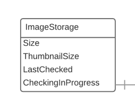

# ImageStorage

Resource that shows how much storage a registered DLCS asset uses. 

`/customers/{customer}/spaces/{spaceId}/images/{imageId}/storage`

## Supported operations

| Method | Label                    | Expects | Returns            | Statuses              |
|--------|--------------------------|---------|--------------------|-----------------------|
| GET    | Retrieve a Image Storage |         | vocab:ImageStorage | 200 OK, 404 Not found |

## Supported properties

### thumbnailSize

Storage space taken up by this item's thumbnails, in bytes

| domain             | range                  | readonly | writeonly |
|--------------------|------------------------|----------|-----------|
| vocab:ImageStorage | xsd:nonNegativeInteger | True     | False     |

### size

Storage space taken up by the DLCS artifacts for this item, in bytes

| domain             | range                  | readonly | writeonly |
|--------------------|------------------------|----------|-----------|
| vocab:ImageStorage | xsd:nonNegativeInteger | True     | False     |

### lastChecked

When these figures were last computed

| domain             | range        | readonly | writeonly |
|--------------------|--------------|----------|-----------|
| vocab:ImageStorage | xsd:dateTime | True     | False     |

### checkingInProgress

If a computation of these figures is currently running

| domain             | range       | readonly | writeonly |
|--------------------|-------------|----------|-----------|
| vocab:ImageStorage | xsd:boolean | True     | False     |

