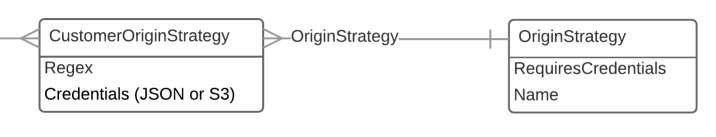

## Examples

An "out of the box" origin strategy provided by the DLCS:

http://dlcs.azurewebsites.net/originStrategies/basic_https

A customer's configured CustomerOriginStrategy resources (these are created by a customer using the API or portal - the association of a customer's URI pattern with an out of the box origin strategy:

http://dlcs.azurewebsites.net/customers/4/originStrategies





