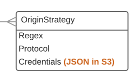

# Origin Strategy



| Field |  | Example |
| -- | -- | -- |
| Regex | If this matches the origin URL, this strategy will be used | https://wellcomelibrary.org/service/dlcsorigins/(.*) |
| Protocol | How the DLCS should fetch the images | https+basic |
| Credentials | The credentials to use. These are not exposed by the DLCS API; the value of this property is the path to an object in S3 storage. Customers can use the portal to set these. | | |

Supported protocols:

* http (no credentials expected)
* https+basic (credentials in S3)
* ftp (credentials in S3)
* ftps (credentials in S3)
* s3 (grant permission)
