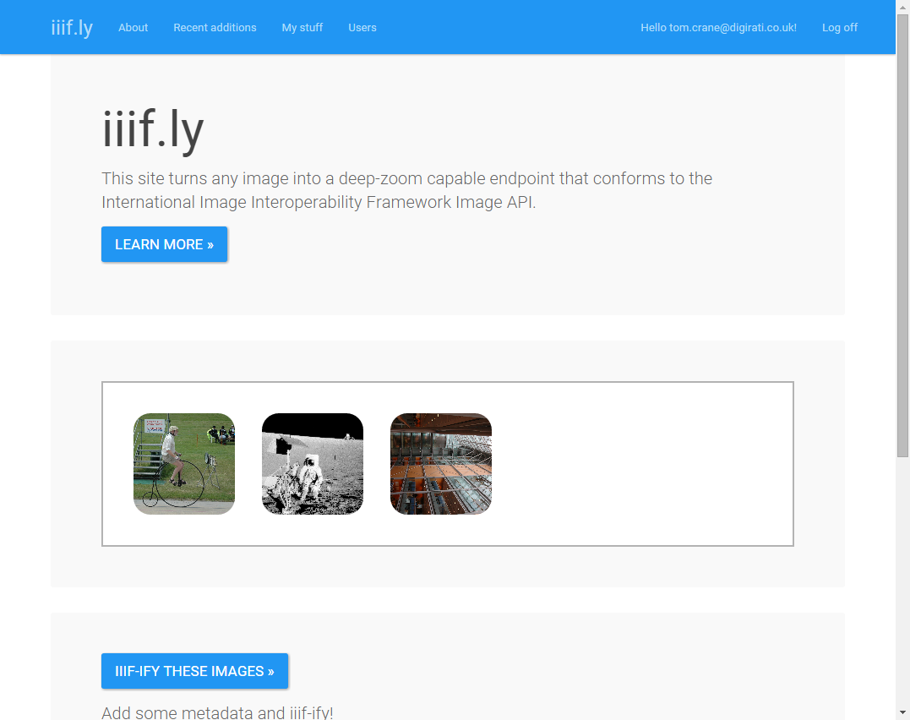
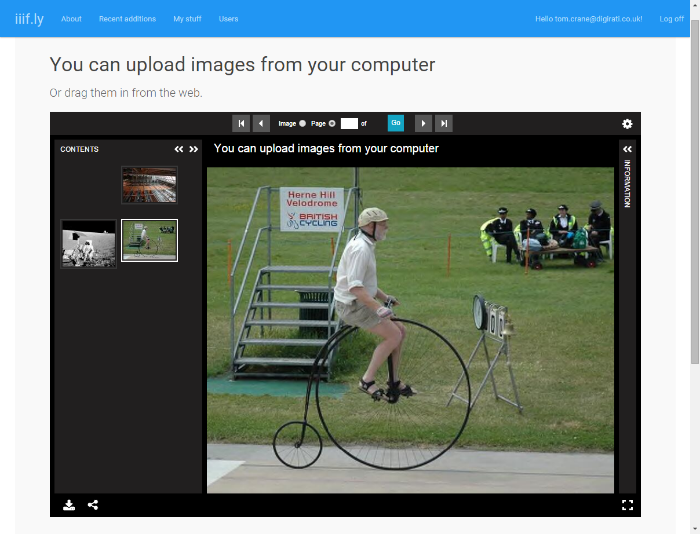

# Overview

## Image registration

Image resources are at the heart of the DLCS. You tell it about an image, it offers services associated with that image. This registration of images can be a manual process, using the user interface of the portal. It can be semi-automated, involving uploading large numbers of images for registration. Or it can be wholly driven by the DLCS API, for integrating with your applications and workflows.

You can register many kinds of image. JPEGs, JPEG2000 and TIFFs are typical source images. Other formats that can be converted to bitmaps (such as PDFs) are also supported. Once registered, a IIIF Image API endpoint is available for the image.

When you register an image, you tell the DLCS where it is - the image's ***origin***. The DLCS needs to see the image at registration time. Typically the origin might be an http(s) URL, probably with some access control to protect it. If the image is an archival or preservation master it might not have a URL on the web; the DLCS can also retrieve images via FTP(s), S3, and other protocols. You will need to supply some settings to tell the DLCS how to authenticate so it can retrieve your images from your origin URLs.

If your images are not available at any URL the DLCS can see, you will need to upload them, so the DLCS can fetch them from temporary origin URLs it generates on your behalf. This is similar to uploading a large number of resources to an FTP site.

The preferred pattern for systems integration and application development is to register images via the DLCS API. You send a small JSON payload to the DLCS. This is the image's metadata. This metadata includes the image's origin URL. It also tells the DLCS how to enforce access control on the services it generates for the image, and what level of service to offer to unauthorised users. In addition, you can store custom metadata strings, numbers and tags against each image. These fields let you build interesting bespoke applications on top of the DLCS platform. Fine control over image metadata allows you to aggregate images together to build more complex digital objects.

You can register images one at a time, or in batches. The DLCS queues your batched images and will fetch them from the origin endpoints as the queue is processed.

### Two sample scenarios

#### Integration with digitisation workflow

This is how the Wellcome Library's digitisation workflow uses the DLCS API.

The workflow deals with an individual book or archive item. This could consist of just one image, or potentially hundreds or even thousands of images. At the end of the digitisation workflow for an item, all the images for the item are stored in Library's preservation system, and the digitisation metadata (in this case METS) is saved to disk. At this point the workflow triggers a process that prepares batches of image registrations. The default batch size is 100, and the workflow code will call the DLCS to queue all the images of the book in as many batches as required. The process includes custom metadata for the DLCS to store against each image - in this case, the Library sends four custom fields:

* catalogue reference (a unique identifier for the book)
* volume number (if a multiple volume work: 0, 1, 2...)
* page label (e.g., a page number: "37" or "xvi")
* order (sequential index)

The Library's workflow system includes a dashboard that shows the progress of the images in the DLCS. The dashboard code can query the DLCS to retrieve information for this book in particular, because of the bespoke metadata stored against its images.

The DLCS can also produce a IIIF presentation API manifest for this book, in response to a query that uses these fields.

The API allows the digitisation workflow to monitor the progress of the images in the DLCS and provide instrumentation to Wellcome staff.

#### iiif.ly

(Log in at [https://iiif.ly/](https://iiif.ly/). As this is a demo application you won't be able to create new images and image sets straight away - you'll need to have your account activated).

You can upload images from your computer or drag them in from the web:

After DLCS has processed them you can view them in a compatible viewer. The DLCS creates a manifest for the image set.

This is a demonstration web application that interacts with the DLCS API in real time to create IIIF resources from user input. It demonstrates two modes of registering images - *queued* and *immediate*. It stores a small amount of information about its users in a local database, but uses the DLCS API for everything else. It uses a feature of the DLCS API called ***spaces*** to partition the images by user. The iiif.ly application uses an API key to talk to the DLCS. This key corresponds to a single customer. Within its customer storage it can create unlimited numbers of spaces to organise the images it registers.

A user can drag an image from the web or from the local machine into the iiif.ly upload user interface. When the user submits the form, the iiif.ly code will check to see if the current user already has a space in the DLCS and if not will create one. The iiif.ly application then registers the image with the DLCS in "immediate" mode. This is only permitted for API operations that register one image at a time. It is a synchronous image registration operation suitable for driving a user interface. 

If the user uploaded multiple images at once, they are queued as in the Library example. Once they have all finished processing the iiif.ly application will display the set of images as a single IIIF resource - a manifest. It does this by making use of a DLCS API feature called "named queries". A named query is like a stored procedure in a relational database. As well as encoding the information required to retrieve the images stored in the DLCS, the named query also encodes the information required to *project* the results of a DLCS query into a IIIF resource. 

## IIIF resources and the Linked Data Platform

The DLCS does not at present offer a CRUD API to IIIF resources directly. For example, adding a new IIIF Presentation API Canvas to a manifest by POSTing a new Canvas resource to a Sequence. Instead, the DLCS offers an API to manage image resources, and these DLCS resources result in IIIF resources on dlcs.io. No IIIF resources are served from api.dlcs.io, and no DLCS resources are served from dlcs.io. Your interaction with the API at api.dlcs.io adds image resources to the platform, which results in Image API endpoints on dlcs.io. If you define named queries via the API, you will also get Presentation API resources from dlcs.io.

As a formal specification becomes available for IIIF CRUD, the DLCS will support it.

## The DLCS API

The DLCS provides a Hypermedia API for managing its resources. This API is built using the [Hydra vocabulary](http://www.hydra-cg.com/spec/latest/core/). While the Hydra specification is a work in progress, we have chosen to adopt it in preference to other Hypermedia vocabularies such as HAL or SIREN. We feel that having the DLCS API use the same JSON-LD standard as the IIIF resources it provides will help developers build applications on top of it.

The API *entry point* is at [https://api.dlcs.io](https://api.dlcs.io). Clients of the API must present credentials using Basic authentication over https.

A test version of the API is also available at [http://dlcs.azurewebsites.net](http://dlcs.azurewebsites.net). This can be explored without credentials. 

## The DLCS command line utility

As well as the API, we will provide a command line utility which can be integrated into batch scripts or used directly to interact with the DLCS.

