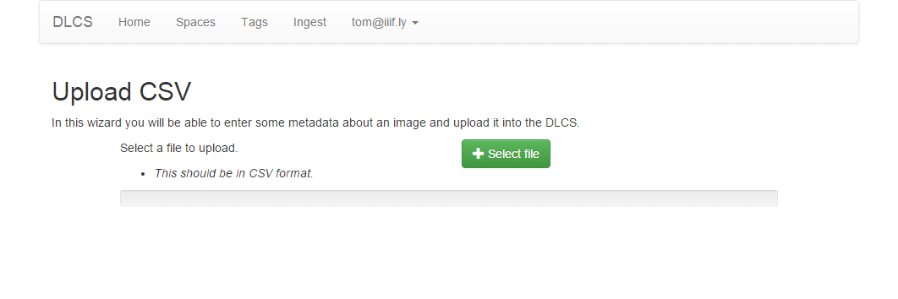
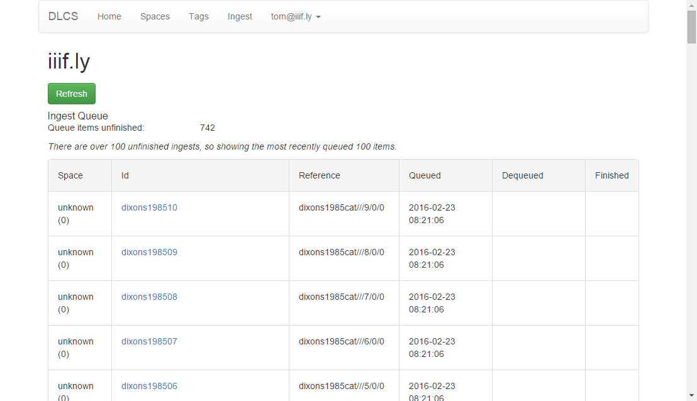

# Registering images in the portal

Currently the portal does not offer very many ways of registering images manually and organising their metadata into manifests.

As the portal is further developed we will add features along the lines indicated in [Other ways to register images](other_ways_to_register_images.md), such as configuring the DLCS to fetch from FTP sites or Amazon S3 buckets. For now, there is a placeholder feature that shows you how you can provide images and metadata to the DLCS in a CSV file.

For many users the portal does not need to provide much functionality - they will write code to integrate the DLCS with their systems. Third parties could create user friendly tools (like iiif.ly) on top of the DLCS API, in the same way that graphical user interfaces for Amazon S3 buckets have become common.

These tools don't exist yet.

This demo CSV file uses a github repository to simulate your origin server. Each of the files listed shares a common metadata field (Reference1) and a varying metadata field (Number1):

When you upload, the DLCS will enqueue the images mentioned in the CSV and start to process them:

Once they are all present, you could use a Named Query to view them as a single manifest:

https://dlcs.io/resource/4/iiifly/F5A41BCF/dixons1985cat

And in a viewer:

http://universalviewer.io/?manifest=https://dlcs.io/resource/4/iiifly/F5A41BCF/dixons1985cat

